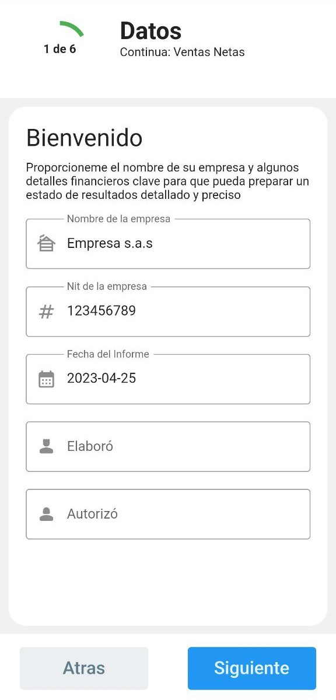
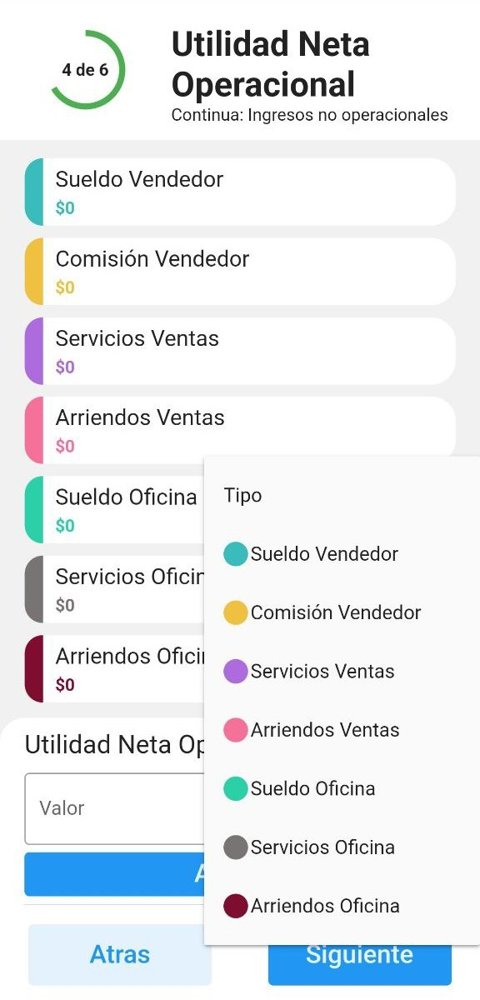
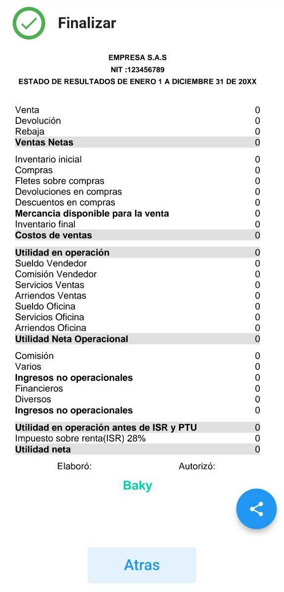

# Flutter Estado de Resultados APP

Esta aplicación está diseñada para ayudarte a generar estados de resultados para tu negocio 🚀. Con un diseño elegante y moderno,

[](https://flutter.dev/)

## Features

- [x] Diseño personalizado
- [x] Navegación por múltiples pantallas
- [x] Generación de PDF
- [x] Cálculos automáticos
- [x] Almacenamiento de datos

## Screenshots
|  |  |  |
| --- | --- | --- |

## Packages uses

Package | Usage
------------ | -------------
[flutter_mailer](https://pub.dev/packages/flutter_mailer) | Una libreria que permite compartir archivos en redes sociales, mediante un modal.
[path_provider](https://pub.dev/packages/path_provider) | Este paquete se utilizo para obtener la carpeta de la aplicación y asi guardar las distintas versiones del estado de resultados en .pdf
[pdf](https://pub.dev/packages/pdf) | Permite generar el pdf.
[syncfusion_flutter_pdfviewer](https://pub.dev/packages/syncfusion_flutter_pdfviewer) | Esta libreria fue muy importante en el desarrollo de la app, porque permite obtener la vista del pdf.


## Building from Source
1. Si no tienes instalado el SDK de [Flutter](https://flutter.dev/), visita el sitio oficial de Flutter.
2. Obtén el código fuente más reciente
```bash
git clone https://https://github.com/leiderCastillo/EstadoDeResultadosApp.git
```
3. Accede a la carpeta del proyecto
```bash
cd EstadoDeResultadosApp
```
3. Ejecuta la aplicación con Android Studio o VS Code. O desde la línea de comandos:
```bash
flutter pub get
flutter run
```

## Contribute
las contribuciones son bienvenidas

## Contact
GitHub [@leiderCastillo](https://github.com/leiderCastillo/)